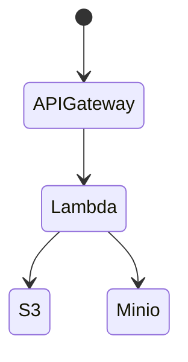

# localstack-playground

LocalStack playground

# Architecture



# Usage

- start localstack and minio

```bash
docker compose up -d
```

- minio
    - http://localhost:19001/login
    - `minioadmin` / `minioadmin`

- create localstack profile if needed

```bash
./configure-localstack-profile.sh
```

- build Lambda function

```bash
cd lambda
pipenv install
pipenv install --dev
pipenv shell

cd greeting
./build.sh
```

- then deploy Lambda function and API Gateway

```bash
# deploy lambda
./deploy-lambda.sh

# deploy api gateway and integration
./deploy-apigateway.sh
```

- invoke API Gateway

```bash
# example request/response
❱❱❱ curl -i -X POST \
  -H 'content-type: application/json' \
  http://localhost:14566/restapis/xc2sd0uadd/local/_user_request_/greeting \
  -d '{"name": "otajisan"}'

HTTP/1.1 200
content-type: application/json
Content-Length: 66
Connection: close
date: Wed, 21 Jun 2023 05:03:42 GMT
server: hypercorn-h11

{"message": "Hello otajisan!", "parameters": {"name": "otajisan"}}
```

- then, you can see result file in S3 and minio

# References

- https://zenn.dev/s_ryuuki/articles/8cf4855713c092